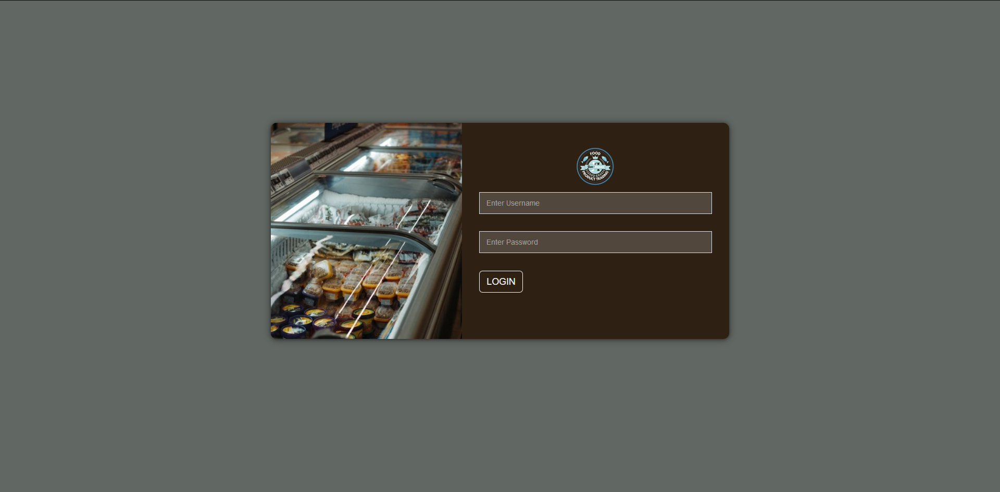
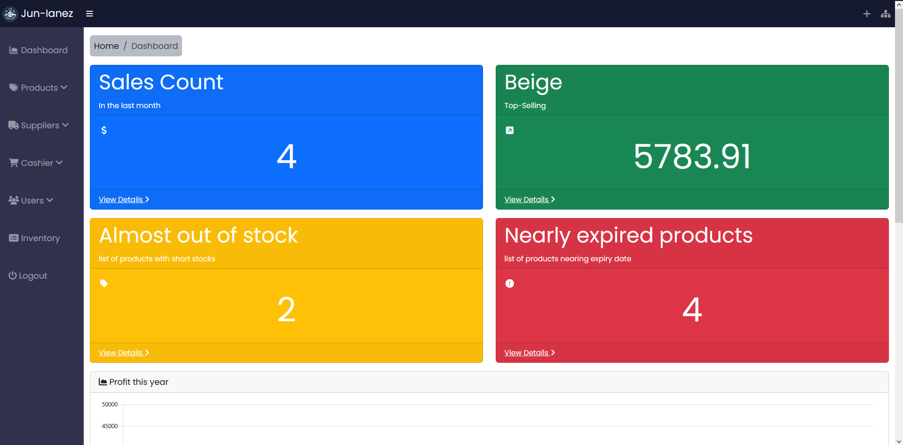
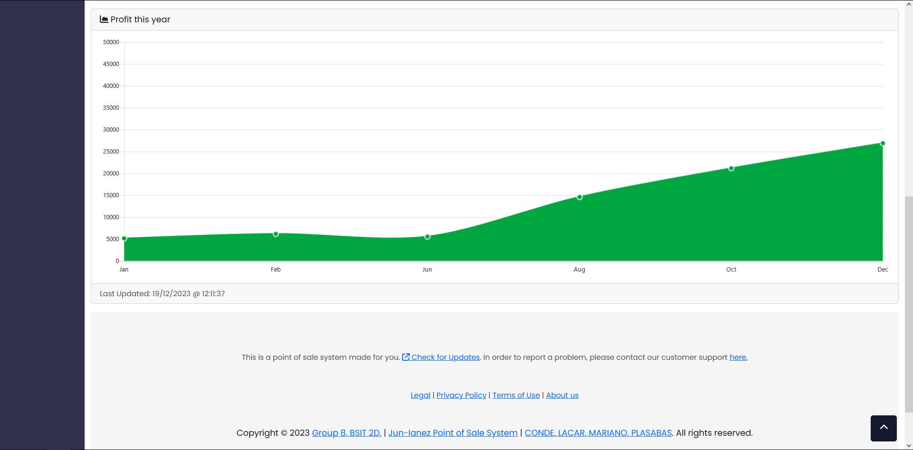
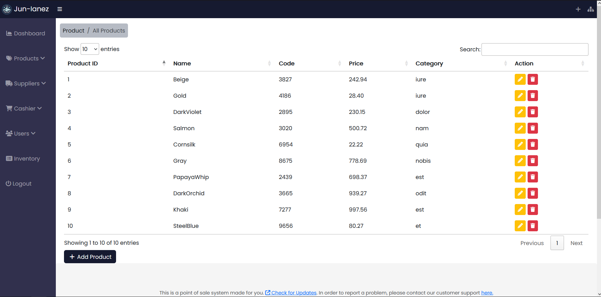
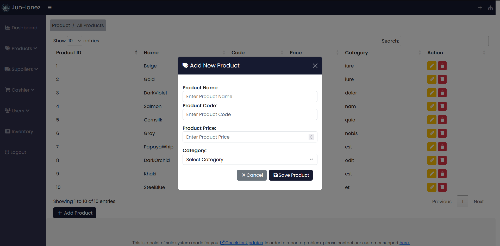
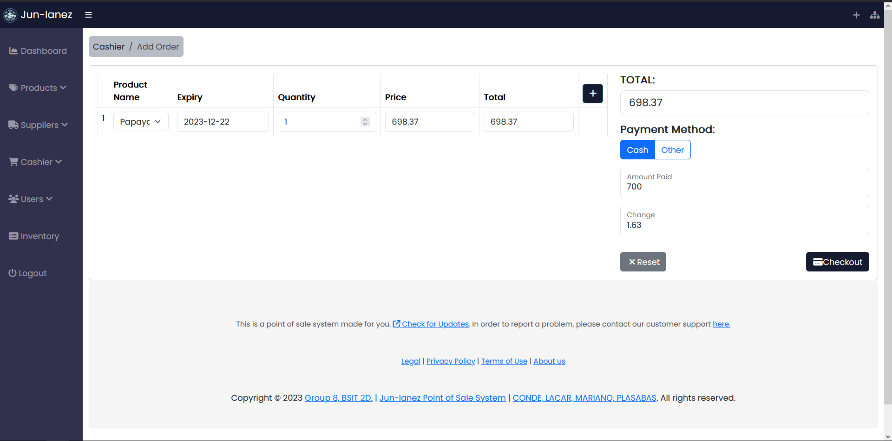
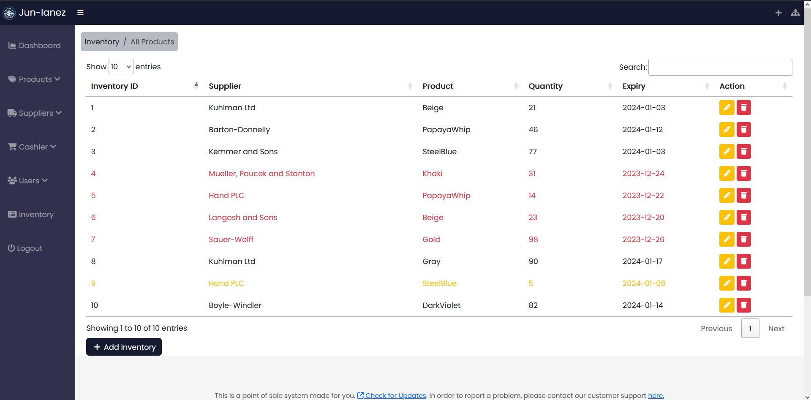

# JUN-IANEZ POS SYSTEM

A point of sale system made by students dedicated for Jun-Ianez Products Trading.

## Installation

1. Clone the repository:
   ```bash
   git clone https://github.com/dongjilo/point-of-sale-system.git [YourDirectoryName]
    ```
2. Navigate to your project directory:
    ```bash
    cd your-project-directory
    ```
3. Install dependencies:
    ```bash
    composer install
    npm install
    ```
4. Create a copy of the `.env-example` and rename it to `.env`:
   ```bash
    cp .env-example .env
   ```
5. Generate Application Key:
   ```bash
    php artisan key:generate
   ```
6. Set up your database credentials and the generated `app_key` in the `.env` file


7. Run the migrations and seed the database:
    ```bash
    php artisan migrate --seed
    ```
## Usage

1. Run the server:
    ```bash
    php artisan serve
    ```
2. Visit `localhost:8000` in your browser
3. Credentials for admin: username: `admin` password:`admin`; for cashier: username:`cashier` password:`123`

## Screenshots
**Login**

**Dasboard**



**Products**



**POS**


**Inventory**

